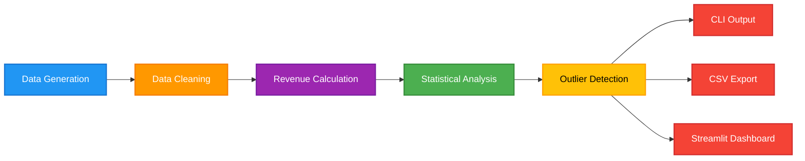

# Sales Analysis Pipeline

[](https://github.com/WanDaiser/sales-analytics-pipeline/actions/workflows/ci.yml)
[](https://www.python.org/downloads/)
[](https://github.com/astral-sh/ruff)
[](https://opensource.org/licenses/MIT)

A production-ready Python data analysis pipeline featuring synthetic sales data generation, revenue analytics, high-value transaction detection, and an interactive Streamlit dashboard.

## Architecture



## Key Features

- **Synthetic Data Generation**: Reproducible sales data with configurable random seed
- **Data Cleaning**: Missing value imputation and data enrichment  
- **Revenue Analytics**: Product-level aggregation and statistical metrics
- **Outlier Detection**: High-value transaction identification using μ + σ threshold
- **CLI Interface**: Command-line tool with flexible parameters
- **Web Dashboard**: Interactive Streamlit application with visualizations
- **Test Coverage**: Comprehensive unit tests with pytest
- **CI/CD Pipeline**: Automated testing and linting via GitHub Actions

## Technology Stack

- **Core**: Python 3.10+, pandas, numpy
- **Dashboard**: Streamlit, matplotlib
- **Testing**: pytest
- **Linting**: ruff
- **CI/CD**: GitHub Actions

## Installation

```bash
# Clone the repository
git clone https://github.com/WanDaiser/sales-analytics-pipeline.git
cd sales-analytics-pipeline

# Install dependencies
python -m pip install --upgrade pip
pip install -r requirements.txt
```

## Usage

### Command-Line Interface

Run the analysis pipeline from the terminal:

```bash
python -m sales_analysis.cli
```

With custom parameters:

```bash
python -m sales_analysis.cli \
  --size 150 \
  --seed 123 \
  --start-date 2025-01-01 \
  --report-path outputs/report.csv \
  --transactions-path outputs/transactions.csv
```

**Sample Output:**

```text
--- Sales Summary ---
 product_id  total_revenue   rating  quantity
       100   12045.67        4.20         45
       101   15234.89        3.85         52
       ...

Avg Revenue: 1870.45 | Std Dev: 1024.77
High Value Transactions: 18
```

### Web Dashboard

Launch the interactive Streamlit dashboard:

```bash
streamlit run src/sales_analysis/app.py
```

Access the dashboard at `http://localhost:8501`

**Dashboard Features:**
- Real-time KPI metrics (total records, average revenue, standard deviation)
- Revenue distribution visualizations
- Product-level performance charts
- High-value transaction filtering
- CSV export functionality

## Project Structure

```text
sales-analytics-pipeline/
├── .github/workflows/
│   └── ci.yml              # GitHub Actions CI/CD
├── src/sales_analysis/
│   ├── __init__.py
│   ├── pipeline.py         # Core data processing functions
│   ├── cli.py              # Command-line interface
│   └── app.py              # Streamlit dashboard
├── tests/
│   ├── test_pipeline.py    # Unit tests for pipeline
│   ├── test_cli.py         # Integration test for CLI
│   └── test_data_quality.py # Data validation tests
├── data/                   # Input data directory
├── outputs/                # Generated reports
├── pyproject.toml          # Project configuration
├── requirements.txt        # Python dependencies
└── README.md
```

## Development

### Running Tests

```bash
# Run all tests
pytest -v

# With coverage report (requires pytest-cov)
pytest --cov=src/sales_analysis --cov-report=term --cov-report=html -v
```

Coverage HTML reports can be viewed by opening `htmlcov/index.html` in a browser.

### Code Linting

```bash
# Check code style
ruff check .

# Auto-fix issues
ruff check --fix .
```

### CI/CD Pipeline

GitHub Actions automatically runs on every push and pull request:
- Tests on Python 3.10 and 3.11
- Code quality checks with ruff
- All checks must pass before merging

## Contributing

Contributions are welcome. Please follow these steps:

1. Fork the repository
2. Create a feature branch (`git checkout -b feature/new-feature`)
3. Commit your changes (`git commit -m 'Add new feature'`)
4. Push to the branch (`git push origin feature/new-feature`)
5. Open a Pull Request

## License

This project is licensed under the MIT License. See the [LICENSE](LICENSE) file for details.

## Author

**WanDaiser**  
GitHub: [@WanDaiser](https://github.com/WanDaiser)

---

*If you find this project useful, please consider giving it a star on GitHub.*
